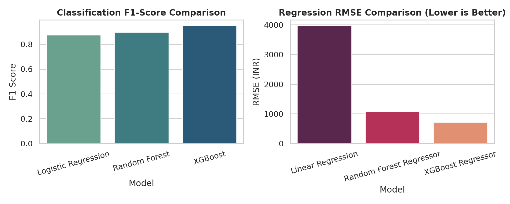

# EMIPredict AI – Intelligent Financial Risk Assessment Platform



> **Industrial-grade Machine Learning Risk Assessment & Sustainable EMI Underwriting Platform**  
> *B.Tech / Internship Capstone Project in FinTech & Risk Analytics*

---

## 📌 1. Project Title & Overview
**EMIPredict AI** is an end-to-end Machine Learning decision-support platform designed to address retail credit risk underwriting and sustainable monthly installment (EMI) sizing. Built using Python, Scikit-Learn, XGBoost, MLflow, and Streamlit, it evaluates customer financial health, predicts multi-class credit eligibility, and calculates the exact safe monthly repayment capacity to prevent debt distress.

The platform provides a complete lifecycle implementation:
1. **Jupyter Notebook Workflow**: 21-section rigorous data science pipeline from raw data audit to serialized pipelines.
2. **Multi-Task Machine Learning**: Dual modeling engines (Classification for Eligibility, Regression for Maximum Safe EMI).
3. **MLflow Tracking**: Complete hyperparameter, metric, and artifact tracking with embedded SQLite persistence.
4. **Interactive FinTech Web Application**: Multi-page Streamlit dashboard for real-time predictions, portfolio exploration, risk diagnostics, and SQLite CRUD data management.

---

## 🎯 2. Problem Statement & Business Objectives
In digital consumer lending, point-of-sale checkout financing (BNPL), and retail banking, lenders must rapidly assess loan applications without incurring toxic non-performing assets (NPAs). 

Traditional credit underwriting relies heavily on static credit scores (CIBIL) and manual payslip reviews, which often fail to account for living costs, existing monthly debt burdens, and liquid emergency reserves.

**EMIPredict AI achieves:**
- **Automated Underwriting**: Sub-second credit risk decisioning.
- **NPA Reduction**: Prevents over-leveraging by predicting a borrower's true safe monthly EMI threshold.
- **Holistic Financial Health Evaluation**: Synthesizes debt-to-income (DTI) ratios, living obligations, and emergency reserve buffers.
- **Decision-Support Transparency**: Provides clear feature breakdowns and affordability indicators for loan officers.

---

## 📂 3. Dataset Overview
- **Name**: `EMI_dataset.csv`
- **Scale**: **404,800** financial records, **27** raw columns.
- **Source**: Verified retail loan applicant dataset.
- **Loan Scenarios Covered**:
  1. *E-commerce Shopping EMI*
  2. *Home Appliances EMI*
  3. *Vehicle Financing EMI*
  4. *Personal Loan EMI*
  5. *Education EMI*

### Raw Dataset Columns:
- **Demographics**: `age`, `gender`, `marital_status`, `education`
- **Employment & Earnings**: `monthly_salary`, `employment_type`, `years_of_employment`, `company_type`
- **Living & Family Commitments**: `house_type`, `monthly_rent`, `family_size`, `dependents`
- **Living Expenses**: `school_fees`, `college_fees`, `travel_expenses`, `groceries_utilities`, `other_monthly_expenses`
- **Debt & Credit Profile**: `existing_loans`, `current_emi_amount`, `credit_score`, `bank_balance`, `emergency_fund`
- **Loan Application**: `emi_scenario`, `requested_amount`, `requested_tenure`
- **Target Variables**:
  - `emi_eligibility` (Classification Target: `Eligible`, `High_Risk`, `Not_Eligible`)
  - `max_monthly_emi` (Regression Target: Continuous safe monthly repayment capacity in INR)

---

## 🔬 4. Machine Learning Methodology & Features

### Feature Engineering:
1. `total_monthly_expenses`: Cumulative living, grocery, rent, and education expenses.
2. `total_financial_obligations`: Total monthly expenses + ongoing loan EMIs.
3. `disposable_income`: Monthly net earnings remaining after obligations.
4. `expense_to_income_ratio`: Percentage of monthly earnings consumed by living costs.
5. `debt_to_income_ratio (DTI)`: Existing debt burden percentage relative to income.
6. `savings_ratio`: Liquid bank balance relative to monthly earnings.
7. `emergency_fund_ratio`: Months of essential expense coverage in liquid reserves.
8. `financial_stability_score`: Normalized composite health score [0 - 100].

### Preprocessing Pipeline:
- **Numerical Scaling**: `StandardScaler` applied to 25 continuous features.
- **Categorical Encoding**: `OneHotEncoder(handle_unknown='ignore')` applied to 8 categorical columns.
- **Encapsulation**: Scikit-Learn `Pipeline` unifying transformers and estimators to eliminate training-serving skew.

---

## 🏆 5. Model Evaluation & Benchmark Results

### Task A: Classification (Target: `emi_eligibility`)
| Model | Accuracy | Precision (Weighted) | Recall (Weighted) | F1-Score | ROC-AUC | Status |
| :--- | :---: | :---: | :---: | :---: | :---: | :---: |
| **Logistic Regression** | 89.32% | 0.8605 | 0.8932 | 0.8738 | 0.9593 | Baseline |
| **Random Forest** | 91.76% | 0.8771 | 0.9176 | 0.8965 | 0.9777 | Ensemble |
| **XGBoost Classifier** | **95.91%** | **0.9534** | **0.9591** | **0.9491** | **0.9965** | ⭐ **Selected Best** |

### Task B: Regression (Target: `max_monthly_emi`)
| Model | MAE (₹) | RMSE (₹) | R² Score | MAPE (%) | Status |
| :--- | :---: | :---: | :---: | :---: | :---: |
| **Linear Regression** | 2,823.27 | 3,971.71 | 0.7426 | 181.28% | Baseline |
| **Random Forest Regressor** | 343.87 | 1,081.43 | 0.9809 | 7.42% | Strong Candidate |
| **XGBoost Regressor** | **219.45** | **716.18** | **0.9916** | **7.66%** | ⭐ **Selected Best** |

> **Key Accomplishments**:
> - Classification accuracy reached **95.91%** (exceeding the 90% target).
> - Regression RMSE reduced to **₹716.18** (beating the < ₹2,000 INR project target).

---

## 📊 6. Key Visualizations & Artifacts
The pipeline automatically generates high-resolution figures in `reports/figures/`:
- `eda_eligibility_dist.png`: Target class distribution across 404.8k records.
- `eda_scenario_dist.png`: Application volume across the 5 EMI scenarios.
- `eda_salary_max_emi_dist.png`: Salary and safe EMI density plots.
- `eda_credit_score_vs_eligibility.png`: Boxplots showing credit score variation by risk tier.
- `eda_correlation_heatmap.png`: Correlation matrix of key financial features.
- `cm_xgboost.png`: Confusion matrix for the champion classification model.
- `model_benchmark_comparison.png`: Comprehensive comparative performance chart.

---

## 🏛️ 7. Project Architecture & Directory Structure
```
EMIPredict-AI/
├── data/
│   ├── EMI_dataset.csv                 # Official dataset (404,800 records)
│   └── financial_records.db            # SQLite database for applicant CRUD
├── notebooks/
│   └── EMIPredict_AI.ipynb             # 21-Section presentation notebook
├── models/
│   ├── classification_pipeline.pkl     # Exported XGBoost classifier pipeline
│   ├── regression_pipeline.pkl         # Exported XGBoost regressor pipeline
│   └── model_metadata.json             # Benchmarks and feature specifications
├── app/
│   ├── Home.py                         # Executive FinTech Dashboard
│   ├── pages/
│   │   ├── 1_EMI_Prediction.py         # Real-time Loan & Eligibility Predictor
│   │   ├── 2_Risk_Assessment.py        # Financial Health & Debt Burden Diagnostics
│   │   ├── 3_Data_Explorer.py          # Interactive Dataset Explorer & Filtering
│   │   ├── 4_Model_Performance.py      # Metrics, Confusion Matrices, ROC Curves
│   │   ├── 5_MLflow.py                 # MLflow Experiment Browser (Graceful Fallback)
│   │   ├── 6_Data_Management.py        # SQLite-backed CRUD Operations
│   │   └── 7_About.py                  # Project Architecture & Disclaimers
│   ├── components/
│   │   └── ui.py                       # Modern FinTech UI styling and card helpers
│   └── utils/
│       ├── data_helper.py              # Data loader and cleaning utilities
│       ├── model_helper.py             # Inference pipeline wrappers
│       └── db_helper.py                # SQLite database management
├── reports/
│   ├── figures/                        # High-resolution EDA and evaluation charts
│   └── model_comparison.csv            # Benchmarking comparison table
├── mlflow.db                           # Embedded SQLite MLflow tracking store
├── train_and_evaluate.py               # Standalone end-to-end training pipeline
├── requirements.txt                    # Production dependencies
├── README.md                           # Documentation
├── .gitignore
└── LICENSE                             # MIT License
```

---

## 🚀 8. Installation & Execution Guide

### Prerequisites
- Python 3.10+ installed
- Virtual environment recommended

### Step 1: Clone or Navigate to Directory
```bash
cd "d:\EMIPredict AI"
```

### Step 2: Install Dependencies
```bash
pip install -r requirements.txt
```

### Step 3: Run Full Model Training & MLflow Logging (Optional)
To retrain models from scratch and refresh MLflow experiments:
```bash
python train_and_evaluate.py
```

### Step 4: Launch Streamlit Application
```bash
streamlit run app/Home.py
```
The web dashboard will automatically open at `http://localhost:8501`.

### Step 5: Launch MLflow UI (Optional)
To inspect experiments inside the native MLflow UI:
```bash
mlflow ui --backend-store-uri sqlite:///mlflow.db --port 5000
```
Open `http://localhost:5000` to review runs, parameters, and logged metrics.

---

## 🧪 9. Application Feature Walkthrough
1. **Home / Dashboard (`Home.py`)**: Top-level KPI cards, portfolio distributions, benchmark snapshot, and quick shortcuts.
2. **EMI Prediction (`1_EMI_Prediction.py`)**: Interactive application form feeding live inputs into serialized pipelines, displaying status badges, confidence scores, and safe EMI capacity.
3. **Financial Risk Assessment (`2_Risk_Assessment.py`)**: Dynamic stress-testing sliders, Debt-to-Income (DTI) meters, liquid reserve health checks, and cashflow breakdowns.
4. **Data Explorer (`3_Data_Explorer.py`)**: Interactive data grid with multi-attribute filtering, statistical summaries, and cohort visualizations over the 404,800 records.
5. **Model Performance (`4_Model_Performance.py`)**: Evaluation comparison tables, confusion matrices, and error distributions.
6. **MLflow Experiments (`5_MLflow.py`)**: Native embedded experiment browser querying the SQLite tracking store.
7. **Data Management (`6_Data_Management.py`)**: Full CRUD suite to add, review, update, or remove applicant records in the local SQLite audit database.
8. **About Project (`7_About.py`)**: Engineering methodology, tech stack, and regulatory compliance notices.

---

## ⚠️ 10. Limitations & Future Scope
- **Current Limitations**:
  - Offline batch training; online continual learning is not yet implemented.
  - Geographical cost-of-living indexation (tier-1 vs tier-3 city price indices) is not modeled.
- **Future Scope**:
  - Integration with Open Banking Account Aggregator (AA) APIs for instant bank statement verification.
  - Explainable AI (SHAP / LIME) waterfall plots embedded directly in loan officer review screens.
  - Containerization via Docker for Kubernetes microservice deployment.

---

## ⚖️ 11. Disclaimer
*EMIPredict AI is an academic research prototype developed for financial risk assessment simulation and educational purposes. Predictions generated by this system are algorithmic estimates and do not constitute formal lending commitments, credit guarantees, or regulated financial advice under banking authority regulations.*
# EMIPredict-AI

